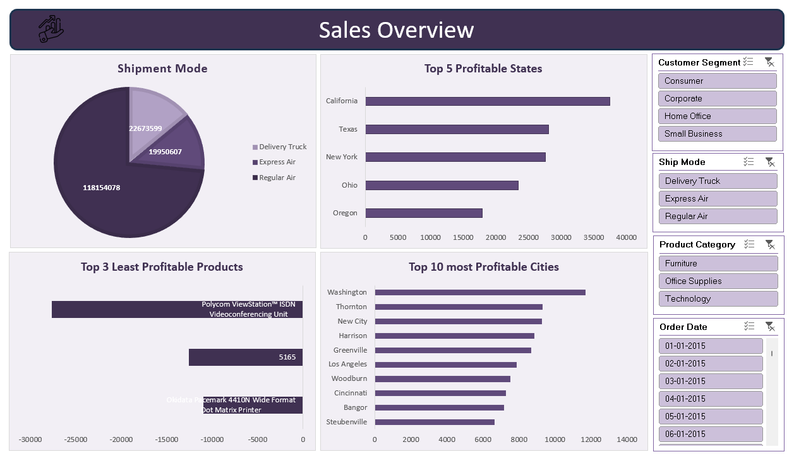

# 📊 Sales Dashboard (Excel)

## 🧭 Overview
This interactive **Excel Sales Dashboard** provides a comprehensive overview of sales performance, profitability, and shipment trends across multiple dimensions.  
It allows users to explore sales insights by **state, city, product category, shipment mode, and customer segment** using interactive slicers.

---

## 🚀 Key Insights
- **Shipment Mode Analysis** — Delivery Truck contributes the highest volume of sales compared to Express Air and Regular Air.
- **Top 5 Profitable States** — California, Texas, and New York lead in total profitability.
- **Top 10 Most Profitable Cities** — Washington and Thornton show the strongest city-level profits.
- **Least Profitable Products** — Identifies underperforming items like Polycom ViewStation™ ISDN Videoconferencing Unit.
- **Interactive Filters** — Segment data dynamically by:
  - Customer Segment (Consumer, Corporate, Home Office, Small Business)
  - Ship Mode (Delivery Truck, Express Air, Regular Air)
  - Product Category (Furniture, Office Supplies, Technology)
  - Order Date (Monthly drill-down)

---

## 🧩 Dashboard Features
- Interactive slicers for filtering and dynamic reporting  
- KPI visuals for quick insights  
- Clean, modern layout using consistent color theme  
- Automated updates through pivot tables and charts  

---

## 🛠️ Tools & Techniques Used
- **Microsoft Excel**
  - Pivot Tables
  - Pivot Charts
  - Slicers for interactivity
  - Data Cleaning and Transformation
- **Design**
  - Custom formatting and color theme for visual consistency
  - Layout optimized for storytelling

---

## 📁 Files
| File | Description |
|------|--------------|
| `Sales_Dashboard.xlsx` | Main interactive dashboard |
| `Dashboard_Preview.png` | Screenshot preview of the dashboard |
| `Data/` *(optional)* | Source data files used for analysis |

---

## 🖼️ Dashboard Preview

---

## 💡 Business Impact
This dashboard helps stakeholders quickly identify:
- The most and least profitable regions, cities, and products  
- Shipment modes driving the highest revenue  
- Key sales trends to improve decision-making  

---

## 👤 Author
**Shadan Tech**   
_Data Analyst_
🔗 [LinkedIn Profile](http://www.linkedin.com/in/shadantech)  
🔗 [Tableau Public Profile](https://public.tableau.com/app/profile/shadan.sarfaraz/vizzes)
🔗 [Newsletter](https://shadantech.substack.com/)

---

## ⭐ Show Your Support

If you found this project insightful, give it a **⭐ Star** on GitHub — it helps others discover it too!  
Connect on **LinkedIn** for more Power BI, Tableau, and Data Analytics projects. 
